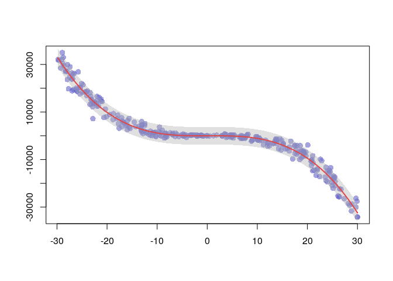

Reintroduction to R, RStudio, and Notebooks
================

One of the 'off-label' goals of this course is making you *very* comfortable thinking about data in a structured way, and manipulating data in a structured way.

With this course, virtually all of our data *could*, in principle, be wrangled in a calculator. No TF necessary here, because we're structuring the comparisons we want to observe *by design* rather than by brute force computation.

Rather than pointing the fire-hose at you (as we will do in ML, storage and retreival, and <ML@S>) we're giving you a gentle introduction. Don't mistake this for an opportunity not to develop your skills.

So, here we go.

Meta Instruction: RStudio
=========================

Head to [this page](https://rmarkdown.rstudio.com/lesson-1.html) and do the following:

-   Watch the short (1 minute video)
-   Read the Introduction, How it Works, Code Chunks, and Inline code sections
-   Come back here and keep working down the worksheet.

What you're reading right now is an RStudio notebook -- just a slight turn on the notebook format that you're familiar with in a jupyter notebook. In these notebooks, the default is that you're writing into the "paper", or "markdown" space. But, if you want to incldue a code chunk, you can. [This file](https://www.rstudio.com/wp-content/uploads/2016/01/rstudio-IDE-cheatsheet.pdf) has a cheatsheet for navigating the Rstudio IDE.

This can be a rather busy place, so feel free to take a moment to customise things. First, head to `Tools > Global Options > Appearance` and pick some colors that make you happy. Maybe head to `Tools > Global Options > Code` and set your keybindings.

You'll see that there are four "panes" in this window. You can choose to arrange what is in the panes however you'd like, but conventionally the editor that you're working with will be in the upper left.

In the upper right of this editor, you can see the **Insert** button. This has options for inserting a code chunk, in the language of your choice: R, bash, python, etc. Since for most of the class, we're going to be working in R, you may as well know the keyboard binding to this:

-   On a Mac: `option+command+i` -- to insert a code chunk.
-   On a PC and \*nix: `control+alt+i` will accomplish the same thing.

Go ahead an insert a chunk below, and include a call for a "Hello World String".

<!-- Insert Chunk Below Here -->
``` r
print("Hellow World String")
```

    ## [1] "Hellow World String"

Note that you don't have to call for a print call surrounding a character string. The default behavior is going to be a print statement if you aren't assigning the results into an object.

Notice that once you insert a code chunk, you get some options:

-   A downward pointing arrow with a bar -- will run all code to that point in the document
-   A rightward facing arrow -- will run all code inside that chunk.

Here are the keyboard bindings that you're going to use most frequently, and [here](https://support.rstudio.com/hc/en-us/articles/200711853-Keyboard-Shortcuts) is the full list of the keyboard bindings.

-   Run a line or selection: `command+Enter` or `control+Enter`
-   Run a chunk: `option+command+c` or `control+alt+c`

Creating Consumable Output
==========================

One of the primary goals of Rstudio -- and the modern useage of the R language -- is to produce documents that are collaborative for members on a team. As an instructional team, we are **super** aligned with this goal. Perhaps we would like to think that most of our time as data scientists will be spent writing code; I think the reality is that the bulk of our time is spent talking with other data scientists about the code that we've written, working to get this or that working, or dithering about with parameters and arguments in our models.

Because collaboration is a first-order goal of the language and the editor, creating documents that share your work is very important.

Suppose you're doing some elementary curve-fitting (the specifics aren't actually that important here).

``` r
x <- runif(300,  min=-30, max=30) 
y <- -1.2*x^3 + 1.1 * x^2 - x + 10 + rnorm(length(x),0,100*abs(x)) 
 
## Can we find a polynome that fit this function ?
model <- lm(y ~ x + I(x^2) + I(x^3))
myPredict <- predict(model, interval="predict")
```

    ## Warning in predict.lm(model, interval = "predict"): predictions on current data refer to _future_ responses

``` r
# Basic plot of x and y :
plot(x, y, col=rgb(0.4,0.4,0.8,0.6), pch=16 , cex=1.3 , xlab="" , ylab="") 
  ix <- sort(x, index.return=T)$ix
  lines(x[ix], myPredict[ix , 1], col=2, lwd=2)  
  polygon(
    c(rev(x[ix]), x[ix]),
    c(rev(myPredict[ix, 3]), myPredict[ix, 2]),
    col = rgb(0.7, 0.7, 0.7, 0.4) ,
    border=NA)
```



You can output all of the work in this notebook, including the code and the resulting plot to a markdown document with a standard tree by navigating to the **knit** button at the top of the editor. After knitting this, navigate to the `reintroduction_to_r.md` file that is in the `Files` tab. You'll see that the the file has been converted into github flavored markdown, with valid links to the image. This is going to be the preferred format for turning in homework for the course -- a `github_document` -- which is called out in the YAML at the top of this file.

But, there are a **bunch** of othe formats. For example, switch the `github_document` to be `html_notebook` in the YAML, and knit again. This time, you're knitting a `.nb.html` file that is a portable document that people can open with a web-browser to see the knitted code and results; or, they can open with Rstudio if they want to execute the code.

Now, on to the work we're after, reminding ourselves about the `R` language!

Head Back
=========

Feel free to save the files that you've edited or touched, and the `File > Quit Session` to close this session. Afte that, you can head back into the ISVC to keep moving through the materials.
